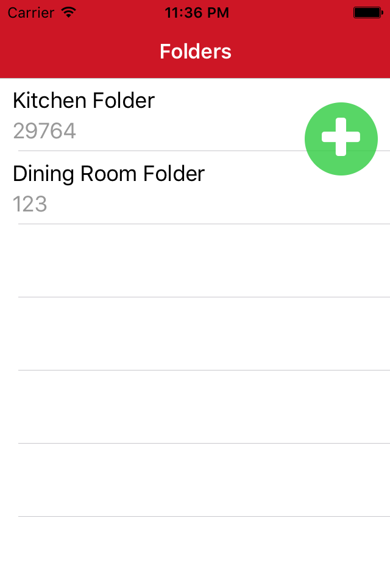

# com.netsmartcompany.floatingActionButton

A simple Floating Action Button for Titanium Alloy Widget. Based off of http://gitt.io/component/be.k0suke.tifab.

## Usage

**Controller**

```javascript
$.addFolderFab.onClick(function(e) {
	addFolderClicked();
});
$.index.open();
```

**View**

```xml
<Alloy>
	<Window>
		<Widget id="addFolderFab" class="fab" src="com.netsmartcompany.floatingActionButton" />
	</Window>
</Alloy>
```

**Style**

```javascript
'.fab': {
    zIndex: 1000,
    top: 20,
    right: 10,
    width: 60,
    height: 60,
    backgroundColor: '#cc2ecc40',
    borderWidth: 1,
    borderColor: '#ececec',
    title: '\uf067',
    font: {
        fontFamily: 'FontAwesome',
        fontSize: 40
    },
    color: '#ffffff'
}
```


## License

MIT